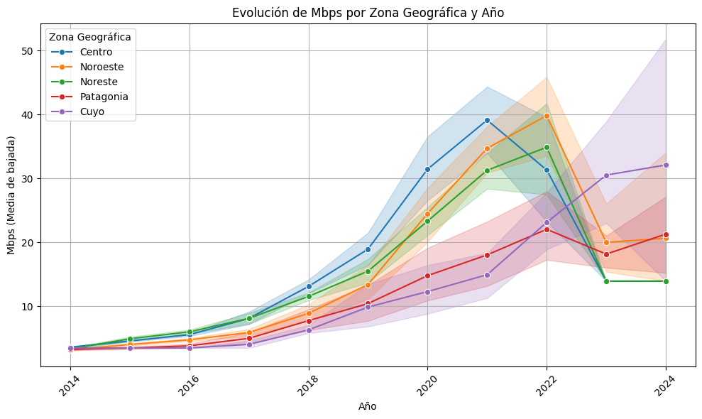
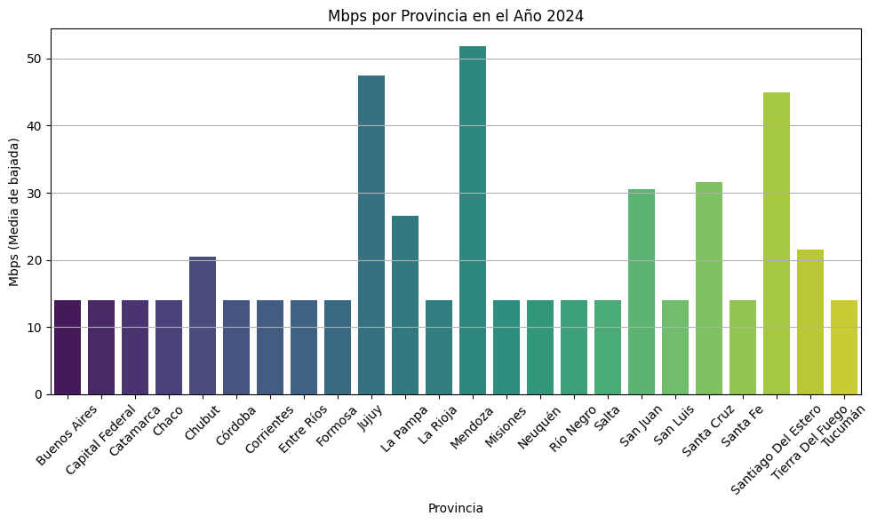
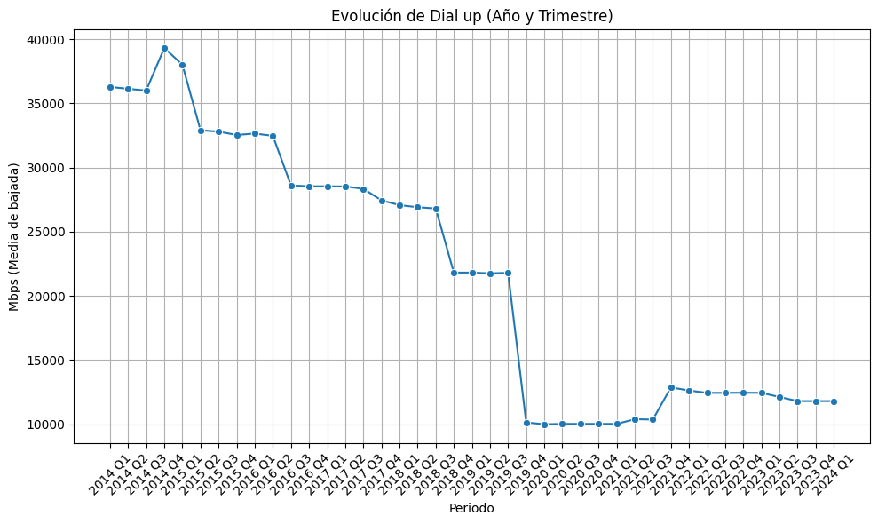
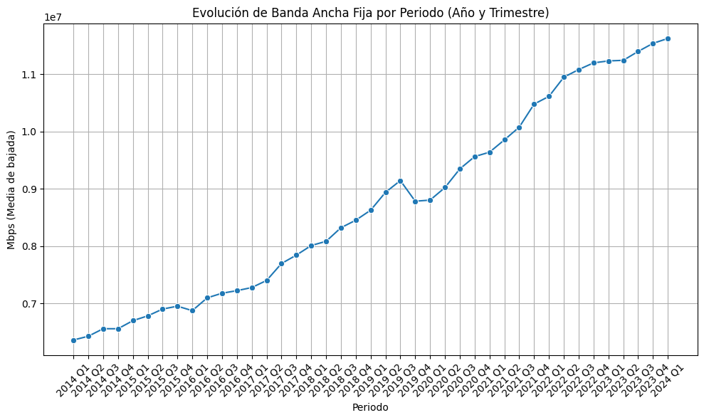

### Proceso de desarrollo

Antes de realizar el dashboard con los objetivos que nos han propuestos he realizado una limpieza de datos y un EDA posterior para la complementación del proyecto asignado.

#### ETL

El proceso de extracción, transformación y carga (ETL) se llevó a cabo en las siguientes libretas:

1. **Internet**: Datasets con datos referidos a esta misma. Esta misma se divide en varias hojas de Excel (como Velocidad por provincia,Ingresos,etc).

He utilizado estos datos para realizar el trabajo desde el github oficial de Soy Henry: [link_limpieza](https://github.com/soyHenry/PI_DA/tree/PART-TIME?tab=readme-ov-file)

Para ser más precisos he realizado este ejercicio con estos datos: [Enlace principal](https://indicadores.enacom.gob.ar/datos-abiertos)

#### EDA
En este proyecto, se ha llevado a cabo un EDA para complementar el Dashboard. A continuación, se presentan las visualizaciones y las observaciones que se han entregados en los distintos ploteos:

**Evolucion de Mbps por Región**
Primero lo que hice fue ordenar las provincias por sus regiones geográficas (por ejemplo región Cuyo) para una mejor lectura de imagen debido a la cantidad de provincias que conforma la República Argentina.

Como se puede observar la región Cuyo es la que más Mbps ha incrementando en el lapso 2014-2024.

**Banda Ancha por provincia**
Se puede observar que la provincia de Mendoza (Región Cuyo) es el lugar donde hay más banda ancha de todo el país. Se acercan algunas provincias tales como Jujuy pero en el resto del territorio argentino se puede notar que hay una igualdad en cuanto a banda ancha.

**Dial**

Aquí se puede notar un decrecimiento del Dial en el periodo que Enacom nos obsequia (del 2014 hasta el primer trimestre de 2024). Esto se debe a que hay mejores tecnologías al día de hoy.

**Banda ancha**

En contra posición a Dial, la Banda Ancha vive un incremento constante en el mismo periodo de tiempo. Creo que esto se debe a que es un mejor servicio que Dial y que por eso la población lo utiliza más.

#### Dashboard

En el archivo del Dashboard hay información que lo cubrí en este formato porque me parece más adecuado. Esta información son los Ingresos,la cantidad de Accesos por hogares,el Acceso a la tecnología y las velocidades de internet en las provincias; sumado al hecho que hay KPIS que solo están en ese formato.

#### Conclusiones

Los ingresos viene en un aumento constante. Esto es debido a la mejora de servicio y que en los días que transcurren el internet se ha vuelto una necesidad para el día a día.

Junto con los ingresos se puede notar que a medidad del tiempo hay cada vez más hogares con el acceso a este servicio.

El cablemodem sigue siendo la tecnología que más se escoge a la hora de prestar el servicio.

#### Recomendaciones

Enacom tiene que actualizar sus datos,todos los datos con lo que he trabajado se ha quedado en el tiempo (solamente cubre el primer trismestre del año 2024).
